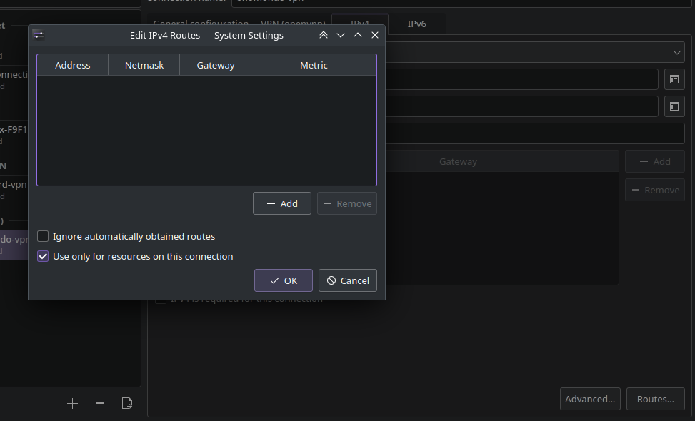
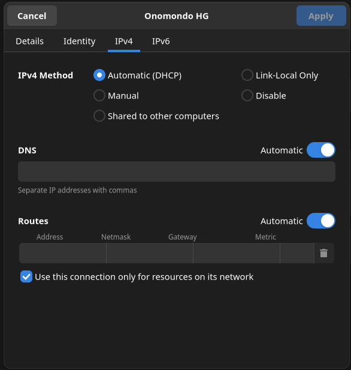

# Arch install notes


## install dependencies


yay -S 1password visual-studio-code-bin rustup lldb systemd-ssh-agent evremap


enable ssh agent service: `systemctl --user enable ssh-agent.service` ??

do this `sudo chmod 666 /var/run/docker.sock` ??


## SSH keys:

From old ssh keys

```
chmod 700 ~/.ssh
chmod 600 ~/.ssh/id_rsa
chmod 644 ~/.ssh/id_rsa.pub
eval `ssh-agent -s`
ssh-add
```


## Konsole setup 

Make new default profile
- Set lines to unlimited under scrolling
- Right click on toolbars and configure toolbars and add
  - Open in file manager 
  - Monitor stuff


## Key Remap:

Add the this `\E\x7f` to the terminal profile in keyboard input `ctrl+backspace`.


To remap num-pad comma:


Edit the `evremap.service` like this:

```
sudo systemctl edit evremap.service
```

Add the following to the edit section: 

```
[Service]
WorkingDirectory=/
ExecStart=
ExecStart=bash -c "evremap remap /home/thor/plusScripts/config/keyRemapConf.toml"
```
Reload the systemdctl `sudo systemctl daemon-reload `

Edit your map in here!


To start with num-lock enabled try this (this may not work...):

```
in systemd-numlockontty 
sudo systemctl enable evremap.service
```


VPN setup (Onomondo):

download the conf from onomondo (see wiki)

In the IPv4 tab set set the "Use this connection only for resources on its network". In KDE it under "routs". See

 


 